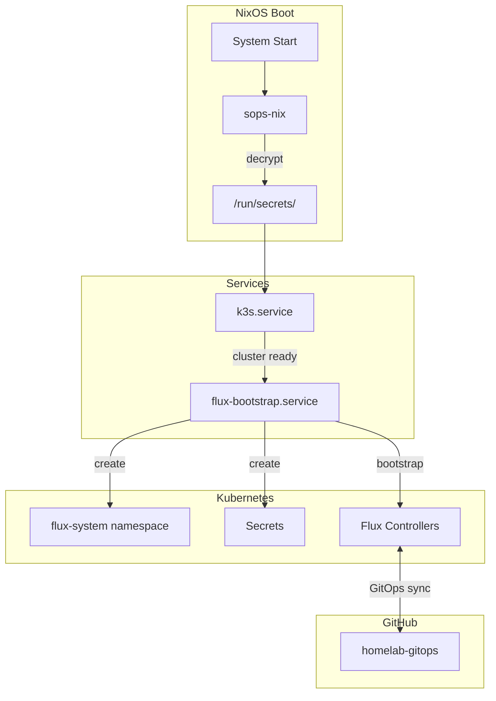

# Homelab Bootstrap Guide

This guide explains how to bootstrap a k3s cluster with Flux GitOps, fully automated through NixOS.

## Architecture Overview

```
┌─────────────────────────────────────────────────────────────────────┐
│                     nixos-config (this repo)                         │
│                                                                      │
│  Manages:                                                            │
│  - Operating system configuration                                    │
│  - k3s installation and cluster bootstrap                           │
│  - Flux bootstrap (automated via systemd)                           │
│  - sops-nix secret decryption                                       │
│                                                                      │
│  Deploy with: nixos-rebuild switch --flake .#<hostname>             │
└───────────────────────┬─────────────────────────────────────────────┘
                        │
                        │ Flux watches ↓
                        │
┌───────────────────────▼─────────────────────────────────────────────┐
│                     homelab-gitops (separate repo)                   │
│                                                                      │
│  Manages:                                                            │
│  - Kubernetes manifests (Deployments, Services, etc.)               │
│  - Flux Kustomizations & HelmReleases                               │
│  - Platform services (ingress, cert-manager, observability)         │
│  - Application workloads                                            │
│  - SOPS-encrypted Kubernetes secrets                                │
│                                                                      │
│  Reconciled automatically by Flux                                    │
└─────────────────────────────────────────────────────────────────────┘
```

## The Bootstrap Flow

When you deploy a homelab server, this happens automatically:



No manual `flux bootstrap` command needed. Just `nixos-rebuild switch` and everything configures itself.

## Prerequisites

- NixOS with flakes enabled
- A GitHub account
- Basic familiarity with Git

## Step 1: Generate Keys

You need three secrets for a fully automated setup:

| Secret | Purpose |
|--------|---------|
| k3s cluster token | Node authentication |
| GitHub deploy key | Flux pulls from your repo |
| SOPS age key | Flux decrypts K8s secrets |

### Generate Age Key (Personal)

```bash
# Create directory for age keys
mkdir -p ~/.config/sops/age

# Generate a new age key
age-keygen -o ~/.config/sops/age/keys.txt

# Note the public key (starts with age1...)
grep "public key" ~/.config/sops/age/keys.txt
```

### Get Host SSH Key

Each NixOS host has an SSH key that sops-nix uses for unattended decryption.

```bash
# On the target host (or use your current host for now)
nix shell nixpkgs#ssh-to-age -c ssh-to-age < /etc/ssh/ssh_host_ed25519_key.pub
```

Save this age public key for the next step.

### Generate GitHub Deploy Key

```bash
# Generate an SSH key for Flux
ssh-keygen -t ed25519 -C "flux" -f ~/.ssh/flux-deploy-key -N ""

# Show the public key (add this to GitHub)
cat ~/.ssh/flux-deploy-key.pub
```

Add this public key to your GitHub repo as a **Deploy Key** with **write access**:
1. Go to your repo → Settings → Deploy Keys
2. Click "Add deploy key"
3. Paste the public key, enable "Allow write access"

### Generate SOPS Age Key (for Flux)

This key lets Flux decrypt SOPS-encrypted Kubernetes secrets.

```bash
# Generate a separate age key for Flux
age-keygen -o ~/.config/sops/age/flux-key.txt

# Note this public key too - add it to .sops.yaml in your homelab-gitops repo
grep "public key" ~/.config/sops/age/flux-key.txt
```

## Step 2: Configure SOPS

### Update .sops.yaml

Edit `secrets/.sops.yaml` with your age public keys:

```yaml
creation_rules:
  # Homelab secrets (k3s cluster token, flux credentials)
  - path_regex: homelab/.*\.yaml$
    key_groups:
      - age:
          - age19qew4x...  # Your personal key
          - age13lj7py...  # Host SSH key (as age)
```

### Create Encrypted Secrets

```bash
# Generate cluster token
TOKEN=$(openssl rand -base64 32)

# Create the secrets file (plaintext first)
cat > secrets/homelab/k3s.yaml << EOF
k3s:
    cluster_token: "$TOKEN"
flux:
    deploy_key: |
$(sed 's/^/        /' ~/.ssh/flux-deploy-key)
    age_key: |
$(sed 's/^/        /' ~/.config/sops/age/flux-key.txt)
EOF

# Encrypt it
sops --config secrets/.sops.yaml -e -i secrets/homelab/k3s.yaml

# Add to git (safe - it's encrypted)
git add secrets/homelab/k3s.yaml
```

## Step 3: Configure NixOS

### Add the homelab-server Role

In your host's `variables.nix`:

```nix
roles = [ "base" "laptop" "desktop" "homelab-server" ];
```

### Enable Flux Bootstrap

In your host's `configuration.nix`:

```nix
homelab.flux = {
  enable = true;
  gitUrl = "ssh://git@github.com/sammasak/homelab-gitops";
  gitBranch = "main";
  gitPath = "clusters/homelab";
};
```

### What This Does

The `homelab.flux` module creates a systemd service that:

1. **Waits** for k3s to be ready
2. **Creates** the `flux-system` namespace
3. **Creates** Kubernetes secrets from `/run/secrets/`:
   - `flux-system` - GitHub deploy key for repo access
   - `sops-age` - Age key for decrypting K8s secrets
4. **Bootstraps** Flux if not already present

```nix
# This happens automatically - no manual steps needed
systemd.services.flux-bootstrap = {
  after = [ "k3s.service" ];
  script = ''
    kubectl create namespace flux-system
    kubectl create secret generic flux-system --from-file=identity=/run/secrets/flux-deploy-key
    kubectl create secret generic sops-age --from-file=age.agekey=/run/secrets/flux-age-key
    flux bootstrap git --url=... --path=...
  '';
};
```

## Step 4: Deploy

```bash
sudo nixos-rebuild switch --flake .#lenovo
```

That's it. Wait a minute and check:

```bash
# Cluster running?
kubectl get nodes

# Flux healthy?
flux check

# GitOps syncing?
flux get kustomizations
```

## Accessing Services

After Flux deploys the infrastructure, services are exposed through ingress-nginx as a `LoadBalancer` service via MetalLB.

Current flow:

1. AdGuard Home resolves `*.sammasak.dev` to the ingress external IP (for example `192.168.10.200`).
2. MetalLB advertises that IP on LAN.
3. ingress-nginx routes by host header to cluster services.

Validate ingress external IP:

```bash
kubectl -n ingress-nginx get svc ingress-nginx-ingress-nginx-controller -o wide
```

### Grafana

Access Grafana at `https://grafana.sammasak.dev` from LAN clients that use AdGuard DNS.

Credentials are stored encrypted in the GitOps repo. To view them:

```bash
cd ~/homelab-gitops
sops -d clusters/homelab/infra/secrets/grafana-admin.secret.yaml
```

See the [homelab-gitops README](https://github.com/sammasak/homelab-gitops#accessing-services) for full service documentation.

## Step 5: Create Your GitOps Repo

If you haven't already, create the `homelab-gitops` repository:

```bash
mkdir homelab-gitops && cd homelab-gitops
git init

# Create initial structure
mkdir -p clusters/homelab/{infra,apps}

# Flux will create clusters/homelab/flux-system/ during bootstrap

git add -A
git commit -m "Initial structure"
git remote add origin git@github.com:sammasak/homelab-gitops.git
git push -u origin main
```

## Adding Workloads

Once Flux is running, everything happens through Git:

```bash
cd ~/homelab-gitops

# Add a HelmRepository
cat > clusters/homelab/infra/helm-repos.yaml << 'EOF'
apiVersion: source.toolkit.fluxcd.io/v1
kind: HelmRepository
metadata:
  name: bitnami
  namespace: flux-system
spec:
  interval: 1h
  url: https://charts.bitnami.com/bitnami
EOF

# Add an app
mkdir -p clusters/homelab/apps/nginx
cat > clusters/homelab/apps/nginx/release.yaml << 'EOF'
apiVersion: helm.toolkit.fluxcd.io/v2
kind: HelmRelease
metadata:
  name: nginx
  namespace: default
spec:
  interval: 5m
  chart:
    spec:
      chart: nginx
      sourceRef:
        kind: HelmRepository
        name: bitnami
        namespace: flux-system
EOF

# Deploy via Git
git add -A && git commit -m "Add nginx" && git push
```

Flux reconciles automatically. Check with `flux get helmreleases`.

## Adding Worker Nodes

### Agent Configuration

```nix
# hosts/worker-1/variables.nix
roles = [ "base" "homelab-agent" ];

# hosts/worker-1/configuration.nix
homelab.k3s.serverAddr = "https://192.168.1.10:6443";  # Your server's IP
```

Deploy: `nixos-rebuild switch --flake .#worker-1`

The agent uses the same cluster token (decrypted via sops-nix) and joins automatically.

## Encrypted Kubernetes Secrets

For secrets in your GitOps repo, configure Kustomizations to use SOPS:

```yaml
# clusters/homelab/apps/kustomization.yaml
apiVersion: kustomize.toolkit.fluxcd.io/v1
kind: Kustomization
metadata:
  name: apps
  namespace: flux-system
spec:
  interval: 10m
  sourceRef:
    kind: GitRepository
    name: flux-system
  path: ./clusters/homelab/apps
  prune: true
  decryption:
    provider: sops
    secretRef:
      name: sops-age  # Created automatically by flux-bootstrap
```

Now you can commit encrypted secrets to your GitOps repo:

```yaml
# Encrypted with SOPS
apiVersion: v1
kind: Secret
metadata:
  name: my-app-secret
stringData:
  api-key: ENC[AES256_GCM,data:...]
```

## Summary: Repo Responsibilities

| Concern | nixos-config | homelab-gitops |
|---------|-------------|----------------|
| OS packages & services | Yes | No |
| k3s installation | Yes | No |
| Firewall & networking | Yes | No |
| Cluster token | Yes | No |
| Flux bootstrap | Yes (automated) | No |
| K8s Deployments | No | Yes |
| HelmReleases | No | Yes |
| Ingress rules | No | Yes |
| K8s Secrets | No | Yes |

## Troubleshooting

### k3s won't start

```bash
journalctl -u k3s -f
# Check token file exists
ls -la /run/secrets/k3s-cluster-token
```

### Flux bootstrap failed

```bash
# Check the bootstrap service
journalctl -u flux-bootstrap -f

# Check secrets were created
ls -la /run/secrets/flux-*

# Manual recovery if needed
kubectl get secrets -n flux-system
```

### Secrets not decrypting

```bash
# Verify sops-nix is working
ls -la /run/secrets/

# Check sops-nix service
systemctl status sops-nix

# Verify host key is in .sops.yaml
ssh-to-age < /etc/ssh/ssh_host_ed25519_key.pub
```

### Node won't join cluster

```bash
# On agent node
journalctl -u k3s -f

# Check connectivity to server
curl -k https://192.168.1.10:6443/version
```

## Further Reading

Learn more about the technologies used (see ~/Documents/knowledge-vault):

- [[Infrastructure/Concepts/nixos-modules]] - NixOS declarative OS configuration
- [[Infrastructure/Concepts/age-encryption]] - Modern encryption with age
- [[Infrastructure/Concepts/sops-nixos]] - Secrets in Git with SOPS
- [[Infrastructure/Concepts/k3s-nixos]] - Lightweight Kubernetes
- [[Infrastructure/Concepts/flux-gitops]] - GitOps for Kubernetes with FluxCD
