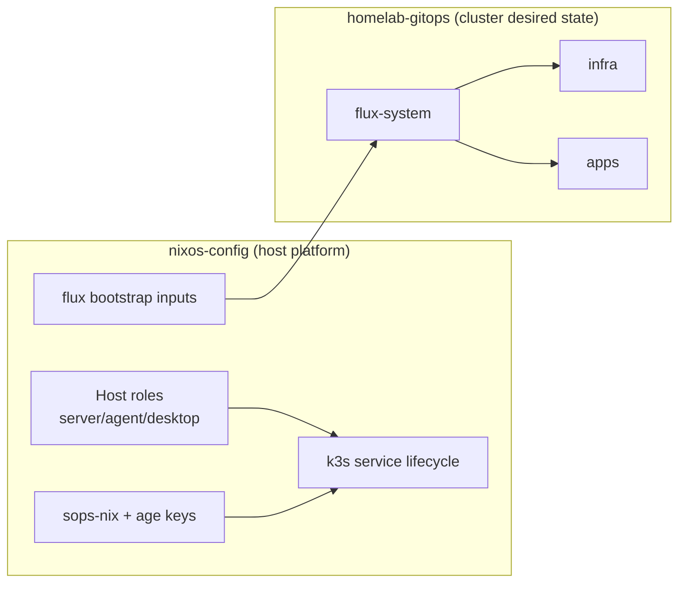
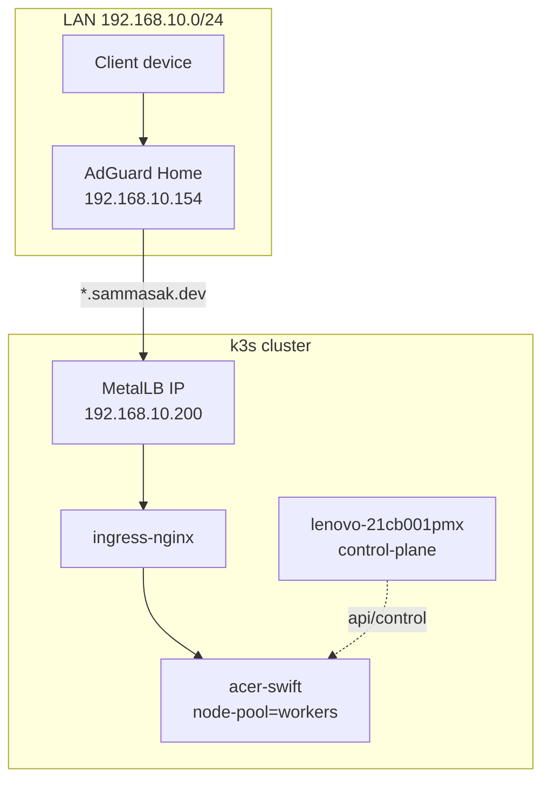

# Homelab Platform - NixOS Layer

> **Purpose:** NixOS-level platform provisioning for the homelab cluster. This repo manages hosts, k3s bootstrap, secrets, and base security defaults.

---

## Scope Boundaries

This repo (`nixos-config`) owns:
- Host OS configuration (NixOS modules/roles)
- k3s server/agent lifecycle on hosts
- SSH/firewall/base hardening defaults
- SOPS/age secret decryption on hosts
- Flux bootstrap wiring

Implementation pattern in this repo:
- `flake-parts` for flake composition and output structure
- `flake.nix` is a minimal entrypoint that auto-imports `flake-modules/`
- `flake-parts.flakeModules.modules` for a typed internal `flake.modules` registry (`deferredModule`)
- top-level flake modules under `flake-modules/` (dendritic trunk)
- module registry under `flake.modules.<class>.<moduleName>` auto-discovered from repo directories
- typed distribution declarations under `configurations.nixos`
- typed host/user contract via `sam.profile` and `sam.userConfig`
- no lower-level `specialArgs` pass-through to reusable NixOS/Home modules
- public flake outputs kept standard (no exposed custom `modules` output)

`homelab-gitops` owns:
- Kubernetes manifests/Helm releases
- In-cluster platform services (ingress, MetalLB, observability, cert-manager)
- Application workloads



---

## Current Cluster Topology (February 2026)

| Node | Function | Kubernetes Role | Labels | Notes |
|------|----------|-----------------|--------|-------|
| `lenovo-21cb001pmx` | control-plane host | `control-plane` | default + control-plane labels | kept relatively light |
| `acer-swift` | worker host | worker | `node-pool=workers` | primary workload node |
| `msi-ms7758` | worker host (GPU) | worker | `node-pool=workers` | legacy NVIDIA (Kepler/470xx), headless; Windows is the gaming OS |



---

## Repository Layout

```text
nixos-config/
├── flake.nix                 # minimal flake-parts entrypoint
├── flake-modules/            # top-level flake modules (dendritic trunk)
│   ├── 20-module-registry.nix
│   ├── 30-configurations-options.nix
│   ├── 40-outputs-nixos.nix
│   └── hosts/                # per-distribution declarations
├── modules/
│   ├── core/                 # users, ssh, security baseline
│   ├── homelab/              # k3s, flux bootstrap, secrets
│   └── roles/                # host role composition
├── hosts/                    # per-host config + variables
└── docs/homelab-platform/
```

`homelab-gitops` cluster layout (high level):

```text
clusters/homelab/
├── flux-system/              # Flux controllers + bootstrap artifacts
├── infra/                    # cluster platform services
│   └── cluster-policies/     # quotas, limits, priority classes
└── apps/                     # app workloads
```

---

## Replication Checklist

For your own fork/adaptation:
- create your host directory at `hosts/<name>/` with `variables.nix`, `configuration.nix`, and `home.nix`
- add one distribution declaration under `flake-modules/hosts/<name>.nix`
- set user identity defaults in `lib/users.nix`
- update secrets recipients in `secrets/.sops.yaml`
- validate builds with `nix build .#nixosConfigurations.<flake-host>.config.system.build.toplevel --no-link`
- run checks with `nix flake check --all-systems --no-write-lock-file`

---

## Operational Model

### Host management
- local: `sudo nixos-rebuild switch --flake .#<host>`
- remote: `nixos-rebuild switch --flake .#<host> --target-host <user@ip> --sudo --ask-sudo-password`

### Cluster management
- all workload/runtime changes happen via `homelab-gitops`
- apply flow: commit -> push -> `flux reconcile`

---

## Security Defaults (Host Side)

- SSH key-based auth
- root SSH login disabled
- firewall enabled with least-open-port posture
- secrets sourced from SOPS, not plaintext in repo

---

## Related Docs

### Project-specific docs (this repo)
- `docs/homelab-platform/BOOTSTRAP.md`
- `docs/homelab-platform/tech/desktop.md`
- `docs/homelab-platform/tech/workstation-images.md`
- `docs/homelab-platform/tech/agent-golden-image.md`
- `docs/homelab-platform/tech/specialisations.md`
- `docs/homelab-platform/tech/inference.md`

### General infrastructure concepts (knowledge-vault)
For general infrastructure knowledge and runbooks, see ~/Documents/knowledge-vault:
- [[Infrastructure/Concepts/nixos-modules]] - NixOS declarative configuration
- [[Infrastructure/Concepts/k3s-nixos]] - Lightweight Kubernetes
- [[Infrastructure/Concepts/flux-gitops]] - GitOps with FluxCD
- [[Infrastructure/Concepts/sops-nixos]] - Secrets management
- [[Infrastructure/Concepts/age-encryption]] - Modern encryption
- [[Infrastructure/Runbooks/bootstrap-homelab]] - Complete bootstrap guide

### Related repos
- `https://github.com/sammasak/homelab-gitops` - Kubernetes manifests and GitOps
- `https://github.com/sammasak/homelab-gitops/blob/main/docs/tech/workstation-fleet.md`
- `https://github.com/sammasak/homelab-gitops/blob/main/docs/tech/workstation-fleet-scope.md`
- `https://github.com/sammasak/homelab-gitops/blob/main/docs/tech/workstation-fleet-verification.md`
