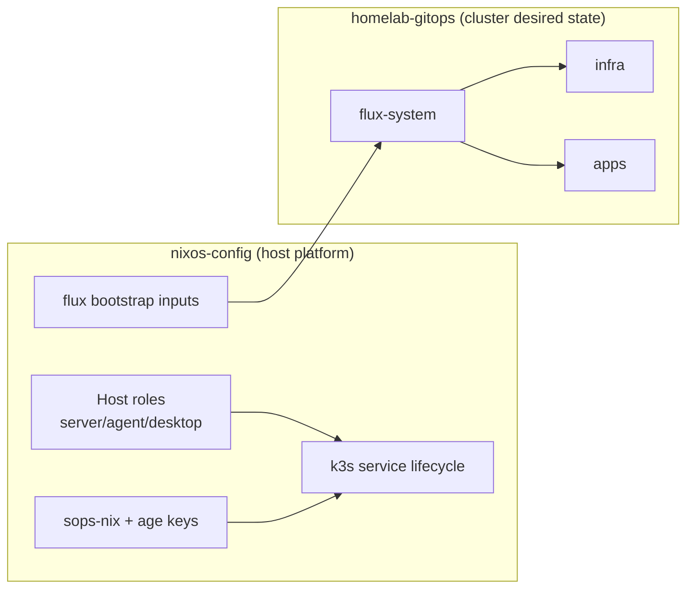
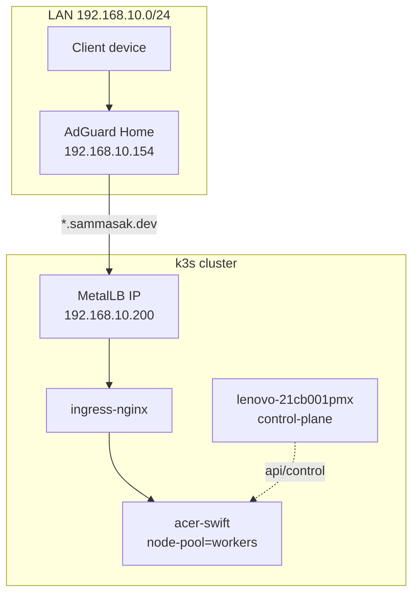

# Homelab Platform - NixOS Layer

> **Purpose:** NixOS-level platform provisioning for the homelab cluster. This repo manages hosts, k3s bootstrap, secrets, and base security defaults.

---

## Scope Boundaries

This repo (`nixos-config`) owns:
- Host OS configuration (NixOS modules/roles)
- k3s server/agent lifecycle on hosts
- SSH/firewall/base hardening defaults
- SOPS/age secret decryption on hosts
- Flux bootstrap wiring

`homelab-gitops` owns:
- Kubernetes manifests/Helm releases
- In-cluster platform services (ingress, MetalLB, observability, cert-manager)
- Application workloads



---

## Current Cluster Topology (February 2026)

| Node | Function | Kubernetes Role | Labels | Notes |
|------|----------|-----------------|--------|-------|
| `lenovo-21cb001pmx` | control-plane host | `control-plane` | default + control-plane labels | kept relatively light |
| `acer-swift` | worker host | worker | `node-pool=workers` | primary workload node |



---

## Repository Layout

```text
nixos-config/
├── modules/
│   ├── core/                 # users, ssh, security baseline
│   ├── homelab/              # k3s, flux bootstrap, secrets
│   └── roles/                # host role composition
├── hosts/                    # per-host config + variables
└── docs/homelab-platform/
```

`homelab-gitops` cluster layout (high level):

```text
clusters/homelab/
├── flux-system/              # Flux controllers + bootstrap artifacts
├── infra/                    # cluster platform services
│   ├── cluster-policies/     # quotas, limits, priority classes
│   └── jarvis/               # shared platform dependencies
└── apps/                     # app workloads
```

---

## Operational Model

### Host management
- local: `sudo nixos-rebuild switch --flake .#<host>`
- remote: `nixos-rebuild switch --flake .#<host> --target-host <user@ip> --sudo --ask-sudo-password`

### Cluster management
- all workload/runtime changes happen via `homelab-gitops`
- apply flow: commit -> push -> `flux reconcile`

---

## Security Defaults (Host Side)

- SSH key-based auth
- root SSH login disabled
- firewall enabled with least-open-port posture
- secrets sourced from SOPS, not plaintext in repo

---

## Related Docs

- `docs/homelab-platform/BOOTSTRAP.md`
- `docs/homelab-platform/tech/k3s.md`
- `docs/homelab-platform/tech/flux.md`
- `https://github.com/sammasak/homelab-gitops`
