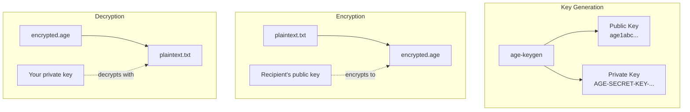

# age - Simple, Modern Encryption

## What Is age?

[age](https://github.com/FiloSottile/age) (pronounced like the Italian "aghe") is a simple, modern encryption tool created by Filippo Valsorda, who leads cryptography at Google. The design philosophy:

- **One good algorithm** instead of many options
- **Small, readable keys** that fit in a URL
- **No configuration** - it just works
- **Composable** - encrypt to multiple recipients easily

## Key Format

age keys are refreshingly simple:

```bash
# Public key (safe to share)
age1qy9v5rh2cqgr84t4jn5m77z4usdg5w3vw4hvt6wrh8z7zv8jd7xsrj4g3u

# Private key (keep secret)
AGE-SECRET-KEY-1QQQQQQQQQQQQQQQQQQQQQQQQQQQQQQQQQQQQQQQQQQQQQQQQQQQQ
```

Compare that to a PGP key block...

## How It Works



### Generate a Key

```bash
age-keygen -o key.txt

# Output:
# Public key: age1qy9v5rh2cqgr84t4jn5m77z4usdg5w3vw4hvt6wrh8z7zv8jd7xsrj4g3u
# (private key saved to key.txt)
```

### Encrypt a File

```bash
# Encrypt to one recipient
age -r age1qy9v5rh... -o secret.age plaintext.txt

# Encrypt to multiple recipients
age -r age1abc... -r age1xyz... -o secret.age plaintext.txt
```

### Decrypt a File

```bash
age -d -i key.txt secret.age > plaintext.txt
```

## SSH Key Compatibility

Here's where it gets clever: age can use your existing SSH ed25519 keys. No new keys to manage.

```bash
# Encrypt using an SSH public key
age -R ~/.ssh/id_ed25519.pub -o secret.age plaintext.txt

# Decrypt using an SSH private key
age -d -i ~/.ssh/id_ed25519 secret.age > plaintext.txt
```

### Converting SSH Keys to age Format

The `ssh-to-age` tool converts SSH public keys to age format:

```bash
# Convert an SSH public key
ssh-to-age < ~/.ssh/id_ed25519.pub
# Output: age1xyz...

# Convert a host's SSH key
ssh-keyscan hostname | ssh-to-age
```

This is particularly useful for NixOS hosts, which already have SSH host keys at `/etc/ssh/ssh_host_ed25519_key`.

## How We Use It

In our homelab, age serves as the encryption backend for SOPS:

1. **Personal key** - Your development machine's age key
2. **Host SSH keys** - Each NixOS host's SSH key, converted to age format

This means:
- You can encrypt secrets on your laptop
- Any host can decrypt secrets at boot (using its SSH key)
- No manual key distribution needed

```yaml
# .sops.yaml - who can decrypt what
creation_rules:
  - path_regex: homelab/.*\.yaml$
    age:
      - age1abc...  # Your personal key
      - age1xyz...  # Host's SSH key (as age)
```

## Why Not Just Use age Directly?

You could! But SOPS adds:
- Encrypted values in readable YAML (not binary blobs)
- Git-friendly diffs (only changed values show up)
- Editor integration (`sops secrets.yaml` opens decrypted in $EDITOR)
- Kubernetes and Flux integration

age handles the cryptography. SOPS handles the workflow.

## Further Reading

- [age GitHub](https://github.com/FiloSottile/age) - Source and documentation
- [age Specification](https://age-encryption.org/v1) - The protocol spec (it's short!)
- [ssh-to-age](https://github.com/Mic92/ssh-to-age) - SSH to age key conversion
