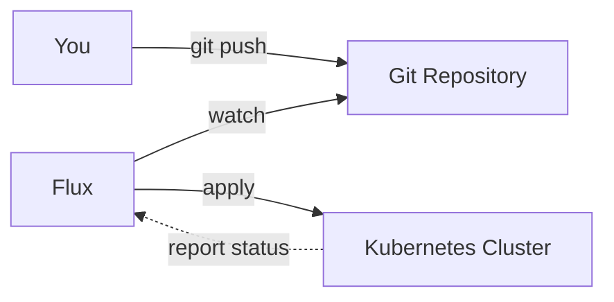
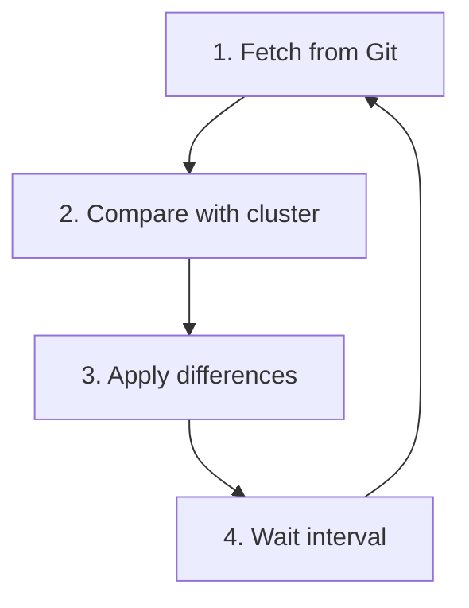
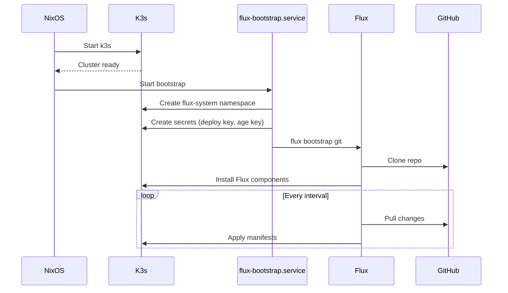

# FluxCD - GitOps for Kubernetes

> Git push. Deploy happens. That's it.

## What Is GitOps?

GitOps is infrastructure as code taken to its logical conclusion:

1. **Git is the source of truth** - Your desired state lives in a repo
2. **Changes happen through Git** - No `kubectl apply` from laptops
3. **Automated reconciliation** - The cluster constantly syncs with Git
4. **Drift correction** - Someone manually changed something? It gets fixed.

## What Is Flux?

[FluxCD](https://fluxcd.io/) is a CNCF graduated project that implements GitOps for Kubernetes. It watches your Git repository and automatically applies changes to your cluster.



## The Reconciliation Loop

Flux continuously runs this loop:



Every few minutes (configurable), Flux:
1. Pulls the latest from your repo
2. Compares manifests with what's running
3. Applies any differences
4. Reports status back

## Key Components

Flux is built from several controllers:

### Source Controller

Manages where your configs come from:

```yaml
apiVersion: source.toolkit.fluxcd.io/v1
kind: GitRepository
metadata:
  name: homelab
spec:
  url: ssh://git@github.com/sammasak/homelab-gitops
  ref:
    branch: main
  interval: 1m
```

### Kustomize Controller

Applies manifests from your repo:

```yaml
apiVersion: kustomize.toolkit.fluxcd.io/v1
kind: Kustomization
metadata:
  name: apps
spec:
  sourceRef:
    kind: GitRepository
    name: homelab
  path: ./apps
  interval: 10m
  prune: true  # Delete removed resources
```

### Helm Controller

Deploys Helm charts declaratively:

```yaml
apiVersion: helm.toolkit.fluxcd.io/v2
kind: HelmRelease
metadata:
  name: nginx
spec:
  chart:
    spec:
      chart: nginx
      sourceRef:
        kind: HelmRepository
        name: bitnami
  interval: 1h
```

### Notification Controller

Sends alerts when things happen:

```yaml
apiVersion: notification.toolkit.fluxcd.io/v1beta3
kind: Alert
metadata:
  name: slack
spec:
  providerRef:
    name: slack-webhook
  eventSources:
    - kind: Kustomization
      name: '*'
```

## Why Flux?

- **CNCF Graduated** - Production-ready, well-maintained
- **Kubernetes-native** - Uses CRDs, works with standard tooling
- **Multi-tenancy** - Different teams, different repos, same cluster
- **SOPS integration** - Encrypted secrets in Git, decrypted at deploy time
- **Dependency ordering** - Deploy infrastructure before apps

## SOPS Integration

Flux can decrypt SOPS-encrypted secrets automatically:

```yaml
# This is encrypted in Git
apiVersion: v1
kind: Secret
metadata:
  name: my-secret
stringData:
  password: ENC[AES256_GCM,data:abc123...]
```

Configure decryption in your Kustomization:

```yaml
apiVersion: kustomize.toolkit.fluxcd.io/v1
kind: Kustomization
metadata:
  name: apps
spec:
  decryption:
    provider: sops
    secretRef:
      name: sops-age  # Contains the age private key
```

## How We Use It

### Bootstrap Flow



### Repository Structure

We use a separate repo for Kubernetes manifests:

```
homelab-gitops/
├── clusters/
│   └── homelab/
│       ├── flux-system/     # Flux itself
│       └── apps.yaml        # What to deploy
├── infra/
│   ├── cert-manager/
│   └── ingress-nginx/
└── apps/
    ├── homepage/
    └── actual-budget/
```

### Two-Repo Architecture

```
nixos-config (this repo)          homelab-gitops
├── NixOS configuration           ├── Kubernetes manifests
├── k3s setup                     ├── Helm releases
├── Flux bootstrap module         ├── App configs
└── SOPS secrets (encrypted)      └── SOPS secrets (encrypted)
```

NixOS handles the cluster. Flux handles what runs on it.

## Useful Commands

```bash
# Check Flux health
flux check

# See what Flux is managing
flux get all

# See Kustomization status
flux get kustomizations

# Force reconciliation
flux reconcile kustomization apps

# View Flux logs
flux logs

# Suspend reconciliation (for debugging)
flux suspend kustomization apps
flux resume kustomization apps
```

## Further Reading

- [FluxCD Documentation](https://fluxcd.io/flux/) - Official docs
- [GitOps Toolkit](https://fluxcd.io/flux/components/) - Component deep dives
- [Flux SOPS Guide](https://fluxcd.io/flux/guides/mozilla-sops/) - Secrets integration
- [Flux Examples](https://github.com/fluxcd/flux2-kustomize-helm-example) - Reference architecture
