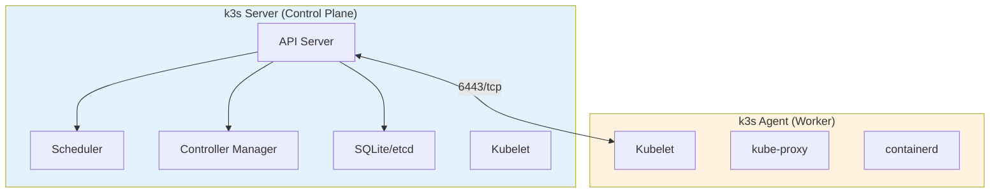
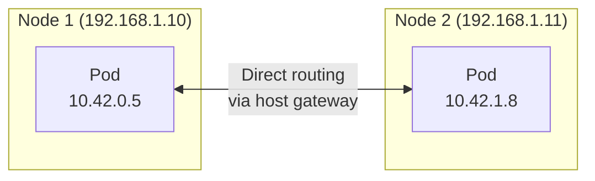

# k3s - Lightweight Kubernetes

> Kubernetes that doesn't need a datacenter.

## The Problem

Kubernetes is powerful. It's also heavy. A typical k8s control plane wants:
- Multiple nodes for high availability
- Gigabytes of RAM just for system components
- Complex etcd cluster management
- Separate installations for each component

For a homelab, that's overkill. You want Kubernetes features without the enterprise overhead.

## What Is k3s?

[k3s](https://k3s.io/) is Kubernetes stripped down to essentials. Created by Rancher Labs, it packages everything into a single ~70MB binary that runs comfortably on a Raspberry Pi.

Same Kubernetes API. Same kubectl. Same YAML manifests. Just lighter.

## k3s vs k8s

| Aspect | Kubernetes | k3s |
|--------|------------|-----|
| Binary size | ~1GB+ | ~70MB |
| Min RAM | 2GB+ | 512MB |
| Install | Multiple components | Single binary |
| Default storage | Requires etcd cluster | SQLite (or etcd) |
| Container runtime | Configurable | containerd |
| Networking | Bring your own | Flannel included |

## Architecture



### Server Nodes

Run the control plane (API server, scheduler, controller manager) plus workloads. One server is enough for a homelab.

### Agent Nodes

Run workloads only. Connect to a server using a cluster token.

## What k3s Removes

k3s achieves its small size by removing:

- **Legacy/alpha features** - Only stable APIs
- **In-tree cloud providers** - No AWS/GCP/Azure code
- **In-tree storage drivers** - Use CSI instead
- **Docker** - Uses containerd directly

Nothing you'll miss in a homelab.

## What k3s Includes

Batteries included:

- **Flannel** - Container networking (CNI)
- **CoreDNS** - Cluster DNS
- **Traefik** - Ingress controller (optional)
- **ServiceLB** - Load balancer (optional)
- **Local Path Provisioner** - Simple storage

You can disable any of these and bring your own.

## How We Use It

### Single Server Setup

Our homelab runs k3s with:

```nix
services.k3s = {
  enable = true;
  role = "server";
  extraFlags = [
    "--disable=traefik"       # We use our own ingress
    "--disable=servicelb"     # Not needed
    "--flannel-backend=host-gw"  # Fast networking
  ];
};
```

### Cluster Token

Nodes authenticate using a shared token, stored encrypted via SOPS:

```yaml
# secrets/homelab/k3s.yaml
k3s:
  cluster_token: ENC[AES256_GCM,data:...]
```

### Adding Workers

Any NixOS machine can join as an agent:

```nix
services.k3s = {
  enable = true;
  role = "agent";
  serverAddr = "https://server:6443";
  tokenFile = "/run/secrets/k3s-cluster-token";
};
```

### Networking

We use Flannel with the `host-gw` backend for nodes on the same subnet. It's simple and fast - packets go directly between hosts without encapsulation.



## Useful Commands

```bash
# Check cluster status
kubectl get nodes

# View all pods (including system)
kubectl get pods -A

# Check k3s service
systemctl status k3s

# View k3s logs
journalctl -u k3s -f

# Get cluster info
kubectl cluster-info
```

## High Availability (Optional)

For production, k3s supports HA with multiple servers:

```
server1 (etcd) <---> server2 (etcd) <---> server3 (etcd)
      |                   |                   |
      +-------------------+-------------------+
                          |
                    load balancer
                          |
                       agents
```

For a homelab, a single server is usually fine. If it dies, you rebuild it from your NixOS config.

## Further Reading

- [k3s Documentation](https://docs.k3s.io/) - Official docs
- [k3s GitHub](https://github.com/k3s-io/k3s) - Source code
- [k3s Architecture](https://docs.k3s.io/architecture) - How it works
