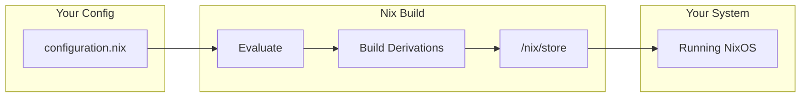

# NixOS - Declarative OS Configuration

> Define your entire operating system in code. Rebuild it anywhere.

## The Problem

Traditional Linux distributions accumulate state over time. You install packages, edit config files, run scripts... and eventually you have no idea how your system got to its current state. Worse, setting up a new machine means hours of "wait, what else did I install?"

## What Is NixOS?

NixOS is a Linux distribution built on the Nix package manager. Instead of imperatively installing software and editing files, you write a configuration file that describes your entire system - packages, services, users, everything.

```nix
# This is your entire system in ~20 lines
{
  boot.loader.systemd-boot.enable = true;

  networking.hostName = "my-server";

  users.users.lukas = {
    isNormalUser = true;
    extraGroups = [ "wheel" ];
  };

  services.openssh.enable = true;

  environment.systemPackages = with pkgs; [
    vim git htop
  ];
}
```

Run `nixos-rebuild switch` and that's your system. Every time.

## Why NixOS?

### Reproducibility

Same configuration = same system. Share your config with someone, and they get an identical setup. No "works on my machine" problems.

### Atomic Upgrades

System updates either succeed completely or don't happen at all. No more half-updated systems that won't boot.

### Easy Rollbacks

Every configuration change creates a new "generation." Boot into any previous generation if something breaks.

```bash
# Oops, that didn't work
sudo nixos-rebuild switch --rollback
```

### Declarative Everything

Instead of remembering commands you ran, your configuration IS the documentation.

## How It Works



Everything lives in `/nix/store` with content-addressed paths like:
```
/nix/store/abc123...-vim-9.0
```

No dependency conflicts possible - each package sees exactly the dependencies it was built with.

## Key Concepts

### Flakes

Modern way to structure Nix projects. Provides:
- Lock files for reproducibility (like `package-lock.json`)
- Standardized project structure
- Composable configurations

```nix
# flake.nix
{
  inputs = {
    nixpkgs.url = "github:NixOS/nixpkgs/nixos-unstable";
    flake-parts.url = "github:hercules-ci/flake-parts";
  };

  outputs = inputs@{ flake-parts, ... }:
    flake-parts.lib.mkFlake { inherit inputs; } {
      imports = [ ./flake-modules/my-host.nix ];
    };
}
```

### Modules

Reusable configuration units. Define options, set defaults, compose together.

```nix
# modules/my-service.nix
{ config, lib, ... }:
{
  options.services.myThing.enable = lib.mkEnableOption "my thing";

  config = lib.mkIf config.services.myThing.enable {
    # Configuration when enabled
  };
}
```

## How We Use It

Our homelab uses NixOS with:
- **flake-parts** to structure flake outputs and system definitions
- A **minimal `flake.nix` entrypoint** that auto-imports top-level flake modules from `flake-modules/`
- **flake-parts modules registry** (`flake-parts.flakeModules.modules`) for typed `deferredModule` exports
- A **dendritic module registry** under `flake.modules.<class>.<moduleName>`, auto-generated from `modules/roles` and `hosts/*/home.nix`
- **Typed distribution declarations** (`configurations.nixos.*`) mapped to flake outputs
- **Typed host/user options** (`sam.profile`, `sam.userConfig`) instead of host-specific `specialArgs`
- **Standard public outputs only** (internal typed registry, no exported custom `modules` output)
- **Role-based composition** (server, agent, desktop) selected per host from `variables.nix`
- **Custom service modules** for k3s, sops, and Flux

The entire cluster configuration lives in Git. A fresh machine can join the cluster with just:
```bash
nixos-rebuild switch --flake github:sammasak/nixos-config#hostname
```

Validation commands used in this repo:

```bash
nix flake check --all-systems --no-write-lock-file
nix build .#nixosConfigurations.<host>.config.system.build.toplevel --no-link
```

## Further Reading

- [NixOS Manual](https://nixos.org/manual/nixos/stable/) - Official documentation
- [Nix Pills](https://nixos.org/guides/nix-pills/) - Deep dive into how Nix works
- [Zero to Nix](https://zero-to-nix.com/) - Modern introduction to Nix
- [flake-parts](https://github.com/hercules-ci/flake-parts) - Flake composition framework
- [flake-parts modules option](https://flake.parts/options/flake-parts-modules.html) - `flake.modules` typed `deferredModule` registry
- [The Dendritic Pattern](https://github.com/mightyiam/dendritic) - Top-level module architecture pattern
- [Dendrix discussion](https://discourse.nixos.org/t/dendrix-dendritic-nix-configurations-distribution/65853) - Distribution-centric dendritic usage
