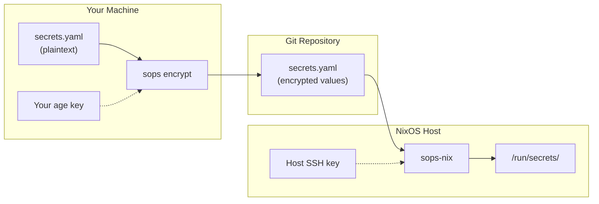
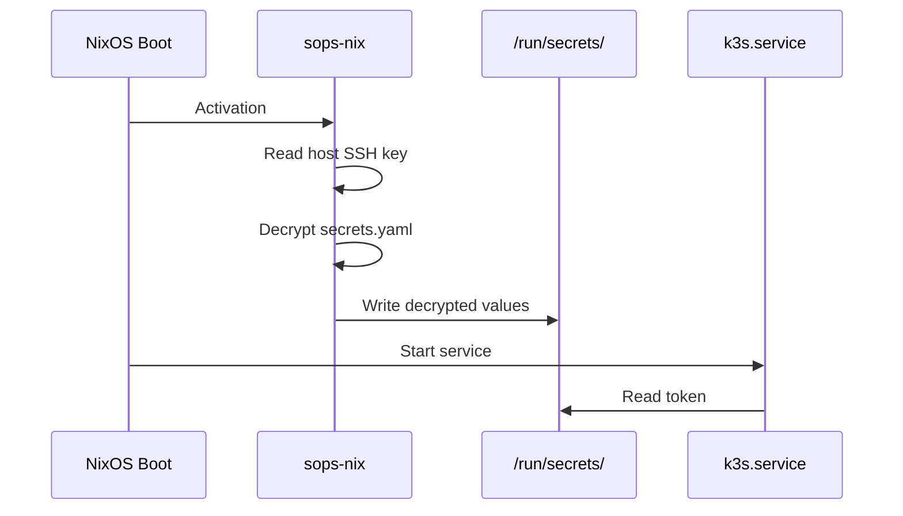

# SOPS - Secrets OPerationS

> Encrypt secrets in Git without losing your sanity.

## The Problem

GitOps promises that everything lives in Git. But what about secrets? API keys, database passwords, certificates - these can't be committed in plain text. You're stuck with:

1. **Don't commit them** - Breaks GitOps purity, manual secret management
2. **Use a secrets manager** - Extra infrastructure, complexity, cost
3. **Encrypt them in Git** - But how do you make that actually usable?

SOPS chooses option 3 and makes it work beautifully.

## What Is SOPS?

[SOPS](https://github.com/getsops/sops) (Secrets OPerationS) is a Mozilla project that encrypts the *values* in structured files while leaving the *keys* readable.

### Before SOPS

```yaml
database:
  host: db.example.com
  password: supersecret123    # This is in Git history forever
```

### After SOPS

```yaml
database:
  host: db.example.com
  password: ENC[AES256_GCM,data:abc123def456,iv:...,tag:...]
```

The structure is preserved. You can see what secrets exist. Code review still works. But the actual values are encrypted.

## How It Works



## Key Concepts

### Multiple Recipients

SOPS can encrypt to multiple keys at once. Each recipient can decrypt independently.

```yaml
# .sops.yaml
creation_rules:
  - path_regex: .*\.yaml$
    age:
      - age1abc...  # Alice can decrypt
      - age1xyz...  # Bob can decrypt
      - age1host... # The server can decrypt
```

Encrypt once, decrypt anywhere (if you have a key).

### Creation Rules

The `.sops.yaml` file defines which keys encrypt which files:

```yaml
creation_rules:
  # Production secrets - only prod hosts
  - path_regex: prod/.*\.yaml$
    age:
      - age1prod1...
      - age1prod2...

  # Dev secrets - everyone
  - path_regex: dev/.*\.yaml$
    age:
      - age1alice...
      - age1bob...
```

### Editing Encrypted Files

SOPS integrates with your editor:

```bash
# Opens decrypted in $EDITOR, re-encrypts on save
sops secrets.yaml
```

Or explicitly:

```bash
# Decrypt to stdout
sops -d secrets.yaml

# Encrypt in place
sops -e -i secrets.yaml
```

## Git-Friendly Diffs

Because only values are encrypted, diffs are meaningful:

```diff
 database:
-  password: ENC[AES256_GCM,data:oldvalue...]
+  password: ENC[AES256_GCM,data:newvalue...]
   host: db.example.com
```

You can see *what* changed even if you can't see *to what*.

## How We Use It

### 1. Store Secrets in Git

```yaml
# secrets/homelab/k3s.yaml
k3s:
  cluster_token: ENC[AES256_GCM,data:...]
flux:
  deploy_key: ENC[AES256_GCM,data:...]
  age_key: ENC[AES256_GCM,data:...]
```

### 2. Configure sops-nix

```nix
# NixOS module
sops = {
  defaultSopsFile = ./secrets.yaml;
  age.sshKeyPaths = [ "/etc/ssh/ssh_host_ed25519_key" ];

  secrets."k3s/cluster_token" = {
    path = "/run/secrets/k3s-cluster-token";
  };
};
```

### 3. Automatic Decryption at Boot

sops-nix decrypts secrets during system activation. They appear at `/run/secrets/` before services start.



### 4. Flux Integration

For Kubernetes secrets, Flux has native SOPS support:

```yaml
# In your GitOps repo
apiVersion: v1
kind: Secret
metadata:
  name: my-secret
stringData:
  password: ENC[AES256_GCM,data:...]
```

Flux decrypts these automatically using the `sops-age` secret we bootstrap.

## Common Commands

```bash
# Create a new encrypted file
sops secrets.yaml

# Edit an encrypted file
sops secrets.yaml

# Decrypt to stdout
sops -d secrets.yaml

# Encrypt an existing file
sops -e -i plaintext.yaml

# Rotate keys (re-encrypt with new recipients)
sops updatekeys secrets.yaml
```

## Further Reading

- [SOPS GitHub](https://github.com/getsops/sops) - Source and documentation
- [sops-nix](https://github.com/Mic92/sops-nix) - NixOS integration
- [Flux SOPS Guide](https://fluxcd.io/flux/guides/mozilla-sops/) - Kubernetes integration
