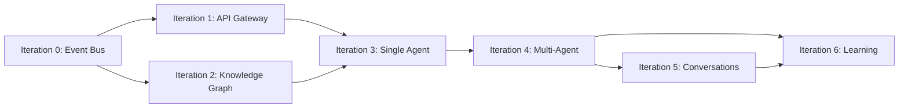

# Jarvis Core - Implementation Iterations

> **Purpose:** Roadmap for building the event-driven agentic coding system.

---

## Iteration Overview

| Iteration | Goal | Status |
|-----------|------|--------|
| **0** | Event Bus (NATS JetStream) | ⬜ Not Started |
| **1** | API Gateway (REST + Intent Parsing) | ⬜ Not Started |
| **2** | Knowledge Graph (PostgreSQL + pgvector) | ⬜ Not Started |
| **3** | Single Agent (CodeAgent with ReAct) | ⬜ Not Started |
| **4** | Multi-Agent (Orchestration) | ⬜ Not Started |
| **5** | Conversations (Stateful Sessions) | ⬜ Not Started |
| **6** | Learning (Feedback Loops) | ⬜ Not Started |

**Status Legend:** ⬜ Not Started | 🔄 In Progress | ✅ Complete

---

## Dependencies



- Iterations 1 and 2 can be developed in parallel after Iteration 0
- Iteration 3 requires both 1 and 2
- Iterations 5 and 6 build on multi-agent foundation

---

## Platform Dependency

Jarvis Core runs on the [Homelab Platform](../homelab-platform/overview.md). Before starting Jarvis iterations:

**Required from Platform:**
- Kubernetes cluster running (Platform Iteration 0)
- Argo Workflows deployed (Platform Iteration 1)

**Recommended:**
- Observability stack (Platform Iteration 2) for debugging

---

## Iteration Summaries

### [Iteration 0: Event Bus](iterations/iteration-0-event-bus.md)

**Goal:** Establish NATS JetStream as the messaging backbone.

**Key Deliverables:**
- NATS JetStream deployed to Kubernetes
- Event type definitions (Rust + Python)
- Publisher/subscriber abstractions
- Stream configuration for all subjects

**Definition of Done:**
- [ ] NATS JetStream running in `jarvis` namespace
- [ ] Can publish/subscribe from Rust and Python
- [ ] All event types defined with schemas
- [ ] Replay from stream working

---

### [Iteration 1: API Gateway](iterations/iteration-1-api-gateway.md)

**Goal:** REST API that accepts intents and publishes to event bus.

**Key Deliverables:**
- FastAPI application deployed
- Intent parsing and validation
- WebSocket support for real-time updates
- Authentication (API key initially)

**Definition of Done:**
- [ ] `POST /api/v1/intents` accepts requests
- [ ] Intent events published to NATS
- [ ] WebSocket streams task updates
- [ ] Swagger docs available

---

### [Iteration 2: Knowledge Graph](iterations/iteration-2-knowledge.md)

**Goal:** PostgreSQL + pgvector for code understanding and history.

**Key Deliverables:**
- PostgreSQL with pgvector deployed
- Schema implemented (repos, files, symbols, tasks)
- Repository indexing pipeline
- Semantic search working

**Definition of Done:**
- [ ] Database running with pgvector extension
- [ ] Can index a repository (files + symbols)
- [ ] Semantic search returns relevant results
- [ ] Task history queryable

---

### [Iteration 3: Single Agent](iterations/iteration-3-single-agent.md)

**Goal:** CodeAgent with ReAct pattern that can make simple changes.

**Key Deliverables:**
- CodeAgent implementation (Python + Pydantic AI)
- Basic tool set (read, edit, search)
- LLM integration (Claude API)
- Guardrails framework

**Definition of Done:**
- [ ] Agent can receive task from event bus
- [ ] ReAct loop executes with Claude
- [ ] Simple code changes work (e.g., "add a comment")
- [ ] Guardrails prevent runaway changes

---

### [Iteration 4: Multi-Agent](iterations/iteration-4-multi-agent.md)

**Goal:** Full agent suite with orchestration.

**Key Deliverables:**
- Planner agent for task decomposition
- TestAgent for test execution
- ReviewAgent for quality checks
- Orchestrator for coordination
- PR creation workflow

**Definition of Done:**
- [ ] Complex intents decomposed into tasks
- [ ] Tests run automatically after changes
- [ ] Review gate before PR creation
- [ ] End-to-end: intent → PR working

---

### [Iteration 5: Conversations](iterations/iteration-5-conversations.md)

**Goal:** Stateful conversation sessions with context preservation.

**Key Deliverables:**
- Conversation state management
- Context accumulation across messages
- Clarification requests
- Voice interface integration

**Definition of Done:**
- [ ] Multi-turn conversations work
- [ ] Context preserved between messages
- [ ] Agent can ask clarifying questions
- [ ] Voice commands work via Home Assistant

---

### [Iteration 6: Learning](iterations/iteration-6-learning.md)

**Goal:** Feedback loops that improve agent performance.

**Key Deliverables:**
- Feedback collection (PR merged/rejected)
- Similar task retrieval
- Pattern recognition
- Success metrics tracking

**Definition of Done:**
- [ ] PR outcomes recorded as feedback
- [ ] Similar past tasks influence planning
- [ ] Success rate metrics available
- [ ] Agent improves on repeated task types

---

## Technology Stack

| Component | Technology | Purpose |
|-----------|------------|---------|
| Event Bus | NATS JetStream | Messaging backbone |
| API | FastAPI (Python) | REST + WebSocket gateway |
| Agents | Pydantic AI (Python) | LLM-powered reasoning |
| Database | PostgreSQL + pgvector | Knowledge storage |
| LLM | Claude API | Reasoning and generation |
| Executor | Rust | Argo workflow bridge |
| Voice | Home Assistant | Voice interface |

---

## Development Workflow

### Local Development

```bash
# Start infrastructure (NATS, PostgreSQL)
docker compose up -d

# Run API Gateway
cd jarvis/src/jarvis_api
uv run uvicorn main:app --reload

# Run agent worker
cd jarvis/src/jarvis_agents
uv run python -m jarvis_agents.worker
```

### Testing

```bash
# Unit tests
uv run pytest

# Integration tests (requires docker compose)
uv run pytest tests/integration/

# End-to-end test
./scripts/e2e-test.sh
```

### Deployment

```bash
# Build images
docker build -t jarvis-api:latest -f Dockerfile.api .
docker build -t jarvis-agents:latest -f Dockerfile.agents .

# Deploy via Flux
git add manifests/
git commit -m "Deploy Jarvis Core"
git push
```

---

## Quick Reference

| Iteration | Key Deliverable | User Value |
|-----------|----------------|------------|
| **0** | NATS running | Foundation for all communication |
| **1** | API accepts intents | Can submit requests |
| **2** | Knowledge graph | Agent understands code |
| **3** | CodeAgent works | Simple changes automated |
| **4** | Full pipeline | Intent → tested PR |
| **5** | Conversations | Natural dialogue |
| **6** | Learning | Improves over time |

---

## Related Documentation

- [Overview](overview.md) - System architecture
- [Events](events.md) - Event types and schemas
- [Knowledge Graph](knowledge-graph.md) - Database design
- [Agents](agents.md) - Agent patterns
- [Homelab Platform](../homelab-platform/overview.md) - Infrastructure

