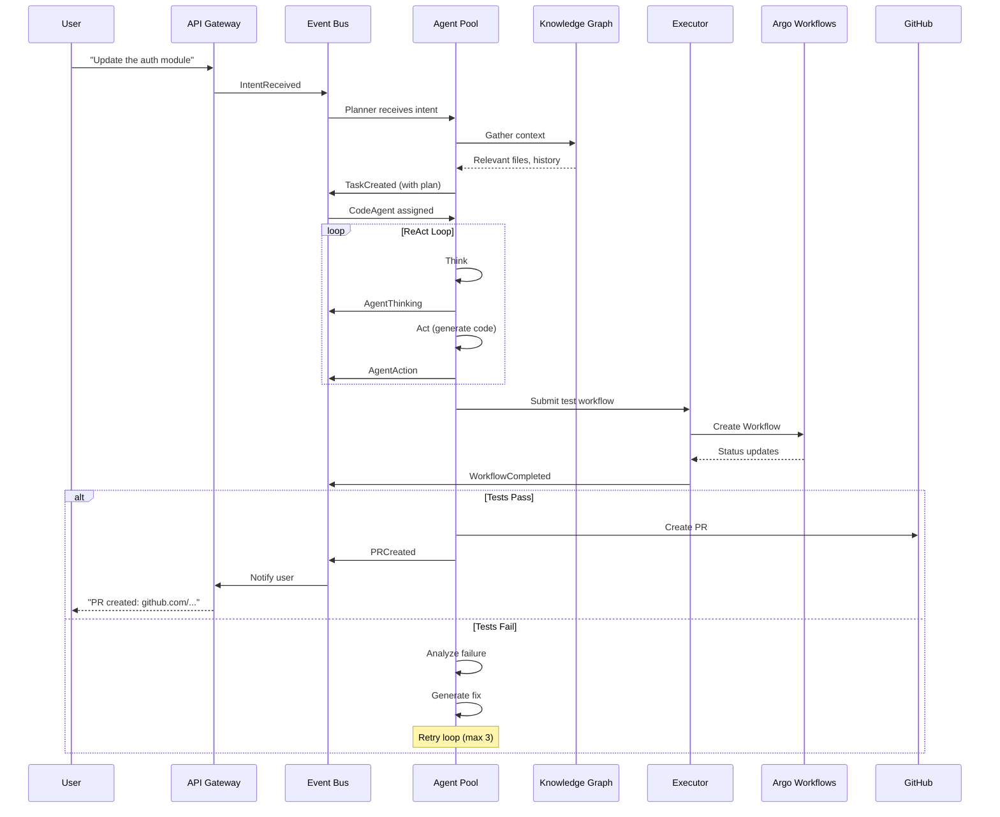

# Jarvis Core

> **Purpose:** A fully event-driven, intelligent coding agent system.
>
> **Status:** Planning

---

## Overview

Jarvis Core is an AI-powered coding assistant that transforms natural language requests into tested, reviewed Pull Requests. It's built on an event-driven architecture with a knowledge graph for code understanding and multi-agent orchestration for complex tasks.

**Key Principle:** Everything flows through events. No synchronous request-response patterns for core functionality.

---

## Design Principles

1. **Event-Driven** - All communication via message queues, enabling loose coupling and observability
2. **Knowledge Graph** - Deep understanding of repositories, code structure, dependencies, and history
3. **Multi-Agent** - Specialized agents for planning, coding, testing, and review
4. **Stateful Conversations** - Context preserved across interactions for natural dialogue
5. **Learning Loop** - Feedback from PR outcomes improves future performance
6. **Safety First** - Guardrails prevent dangerous changes; all changes require human approval via PR

---

## Architecture

```
┌─────────────────────────────────────────────────────────────────┐
│                         JARVIS CORE                             │
│                                                                 │
│  ┌───────────────────────────────────────────────────────────┐  │
│  │                Event Bus (NATS JetStream)                 │  │
│  │                                                           │  │
│  │  jarvis.intent.>   jarvis.task.>   jarvis.agent.>        │  │
│  │  jarvis.workflow.>  jarvis.knowledge.>  jarvis.feedback.>│  │
│  └───────────────────────────────────────────────────────────┘  │
│         │                │                │                     │
│         ▼                ▼                ▼                     │
│  ┌────────────┐   ┌─────────────┐   ┌──────────────┐           │
│  │API Gateway │   │ Agent Pool  │   │Knowledge     │           │
│  │            │   │             │   │Graph         │           │
│  │ • REST API │   │ • Planner   │   │              │           │
│  │ • Voice    │   │ • CodeAgent │   │ • PostgreSQL │           │
│  │ • Webhooks │   │ • TestAgent │   │ • pgvector   │           │
│  │ • CLI      │   │ • Reviewer  │   │ • Embeddings │           │
│  └────────────┘   └─────────────┘   └──────────────┘           │
│         │                │                                      │
│         ▼                ▼                                      │
│  ┌───────────────────────────────────────────────────────────┐  │
│  │                   Executor Bridge                         │  │
│  │           (Submits Argo Workflows to Platform)           │  │
│  └───────────────────────────────────────────────────────────┘  │
└─────────────────────────────────────────────────────────────────┘
                              │
                    Platform API (Kubernetes, Argo)
                              │
┌─────────────────────────────────────────────────────────────────┐
│                     HOMELAB PLATFORM                            │
│         (k3s + Flux + Argo Workflows + Observability)          │
└─────────────────────────────────────────────────────────────────┘
```

---

## Core Components

### 1. Event Bus (NATS JetStream)

The nervous system of Jarvis. All components communicate through events.

**Why NATS JetStream:**
- Purpose-built for messaging (not a database with messaging bolted on)
- Built-in persistence and replay
- Subject-based routing with wildcards
- Lightweight, single binary
- Exactly-once semantics available

**Subject Hierarchy:**
```
jarvis.intent.>          # Intent lifecycle
jarvis.intent.received   # Raw input from any source
jarvis.intent.parsed     # Validated and structured
jarvis.intent.rejected   # Policy violation or error

jarvis.task.>            # Task lifecycle
jarvis.task.created      # New task from intent
jarvis.task.{id}.>       # Per-task events
jarvis.task.{id}.assigned
jarvis.task.{id}.progress
jarvis.task.{id}.completed
jarvis.task.{id}.failed

jarvis.agent.>           # Agent activity
jarvis.agent.{id}.thinking    # Reasoning (for observability)
jarvis.agent.{id}.action      # Tool use
jarvis.agent.{id}.observation # Results

jarvis.workflow.>        # Argo integration
jarvis.workflow.submitted
jarvis.workflow.status
jarvis.workflow.completed

jarvis.knowledge.>       # Knowledge updates
jarvis.knowledge.repo.indexed
jarvis.knowledge.context.gathered

jarvis.feedback.>        # Learning signals
jarvis.feedback.pr.merged
jarvis.feedback.pr.rejected
jarvis.feedback.user
```

See [events.md](events.md) for full event schemas.

---

### 2. API Gateway

Entry point for all external interactions.

**Responsibilities:**
- Accept requests from voice, CLI, webhooks
- Parse and validate input
- Publish `IntentReceived` events
- Provide query endpoints for status
- WebSocket support for real-time updates

**Technology:** Python (FastAPI) for rapid development and good async support

**Endpoints:**
```
POST /api/v1/intents          # Submit new intent
GET  /api/v1/tasks            # List tasks
GET  /api/v1/tasks/{id}       # Task status
GET  /api/v1/tasks/{id}/logs  # Task logs
WS   /api/v1/stream           # Real-time events
POST /api/v1/feedback         # Submit feedback
```

---

### 3. Knowledge Graph

Jarvis's understanding of the code it works with.

**Stores:**
- Repository metadata and configuration
- File structure and content summaries
- Code symbols (functions, classes, methods)
- Dependency relationships
- Task history and outcomes
- Conversation context

**Technology:** PostgreSQL + pgvector for relational data with vector similarity search

**Key Capabilities:**
- Semantic search: "Find code related to authentication"
- Context gathering: Assemble relevant files for a task
- History: What changes were made before?
- Learning: What approaches worked/failed?

See [knowledge-graph.md](knowledge-graph.md) for schema and queries.

---

### 4. Agent Pool

Intelligent agents that accomplish tasks through reasoning and tool use.

**Agent Types:**

| Agent | Responsibility |
|-------|---------------|
| **Planner** | Decompose intents into tasks, create execution plans |
| **CodeAgent** | Understand code, generate changes, fix issues |
| **TestAgent** | Run tests, analyze failures, suggest fixes |
| **ReviewAgent** | Check changes for quality, security, style |

**Pattern: ReAct (Reason + Act)**

```
while not done:
    thought = think(context, observations)  # LLM reasoning
    action = decide_action(thought)         # Choose tool
    observation = execute(action)           # Run tool
    context.add(observation)                # Update state
```

See [agents.md](agents.md) for detailed agent design.

---

### 5. Executor Bridge

Connects Jarvis to the Homelab Platform's Argo Workflows.

**Responsibilities:**
- Submit WorkflowTemplates with parameters
- Watch workflow status
- Stream logs back to Jarvis
- Translate workflow completion to events

**Technology:** Rust for performance and strong Kubernetes client support

---

## Request Flow



---

## Technology Stack

| Component | Technology | Rationale |
|-----------|------------|-----------|
| Event Bus | NATS JetStream | Purpose-built messaging, lightweight |
| API Gateway | Python (FastAPI) | Rapid development, async, Pydantic |
| Agents | Python (Pydantic AI) | Great LLM tooling, type safety |
| Knowledge DB | PostgreSQL + pgvector | Mature, vector search, single DB |
| Executor | Rust | Performance, k8s client, safety |
| LLM | Claude API | Excellent coding ability |
| Voice | Home Assistant | Existing ecosystem |

---

## Safety & Guardrails

Jarvis has multiple safety layers:

### 1. Policy Layer
- Repository must be in catalog with `allow_write: true`
- Operation must be in `allowed_operations` list
- Sensitive paths require explicit approval

### 2. Agent Guardrails
- Maximum files changed per task
- Maximum lines changed per file
- Dangerous pattern detection (credentials, injection)
- Rate limiting on LLM calls

### 3. PR Requirement
- Jarvis NEVER applies changes directly
- All changes go through Pull Requests
- Human review required before merge
- Audit trail in Git history

### 4. Test Gate
- Tests must pass before PR creation
- Failed tests trigger fix attempts (limited)
- Persistent failures reported, not hidden

---

## Platform Requirements

Jarvis Core runs on the [Homelab Platform](../homelab-platform/overview.md) and requires:

| Requirement | Details |
|-------------|---------|
| Namespace | `jarvis` with appropriate RBAC |
| Argo Access | Submit and watch workflows |
| Storage | 10Gi+ PVC for PostgreSQL |
| Secrets | LLM API key, Git tokens |
| Ingress | External access for API/voice |
| Metrics | ServiceMonitor for scraping |

---

## Directory Structure

```
jarvis/
├── Cargo.toml                  # Rust workspace
├── pyproject.toml              # Python workspace (uv)
│
├── crates/                     # Rust crates
│   ├── jarvis-events/          # Event type definitions
│   ├── jarvis-bus/             # NATS client abstraction
│   └── jarvis-executor/        # Argo workflow bridge
│
├── src/                        # Python packages
│   ├── jarvis_api/             # FastAPI gateway
│   ├── jarvis_agents/          # Agent implementations
│   └── jarvis_knowledge/       # Knowledge graph client
│
├── manifests/                  # Kubernetes deployment
│   ├── base/
│   └── overlays/
│       └── homelab/
│
└── workflows/                  # Argo WorkflowTemplates
    ├── code-change.yaml
    ├── test-runner.yaml
    └── repo-scan.yaml
```

---

## Getting Started

See [iterations.md](iterations.md) for the implementation roadmap:

1. **Iteration 0:** Event Bus - NATS JetStream + event types
2. **Iteration 1:** API Gateway - REST API + intent parsing
3. **Iteration 2:** Knowledge Graph - PostgreSQL + pgvector
4. **Iteration 3:** Single Agent - CodeAgent with ReAct
5. **Iteration 4:** Multi-Agent - Orchestration and coordination
6. **Iteration 5:** Conversations - Stateful sessions
7. **Iteration 6:** Learning - Feedback loops

---

## Related Documentation

- [Events](events.md) - Event types and schemas
- [Knowledge Graph](knowledge-graph.md) - Database schema and queries
- [Agents](agents.md) - Agent patterns and implementation
- [Iterations](iterations.md) - Implementation roadmap
- [Homelab Platform](../homelab-platform/overview.md) - Infrastructure this runs on
