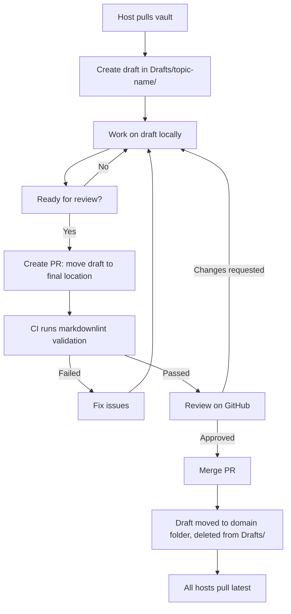
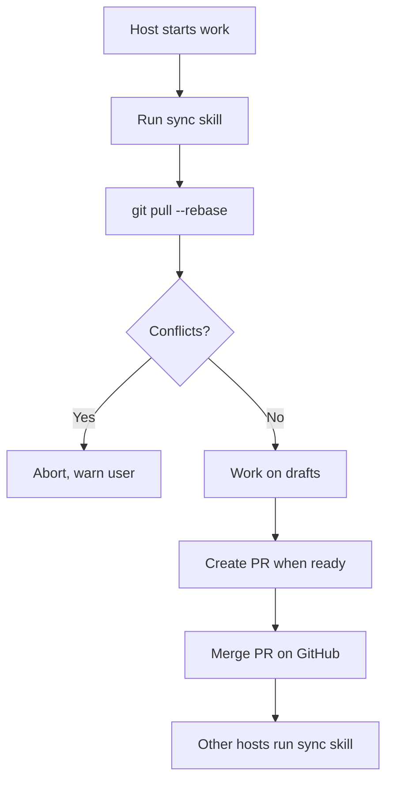
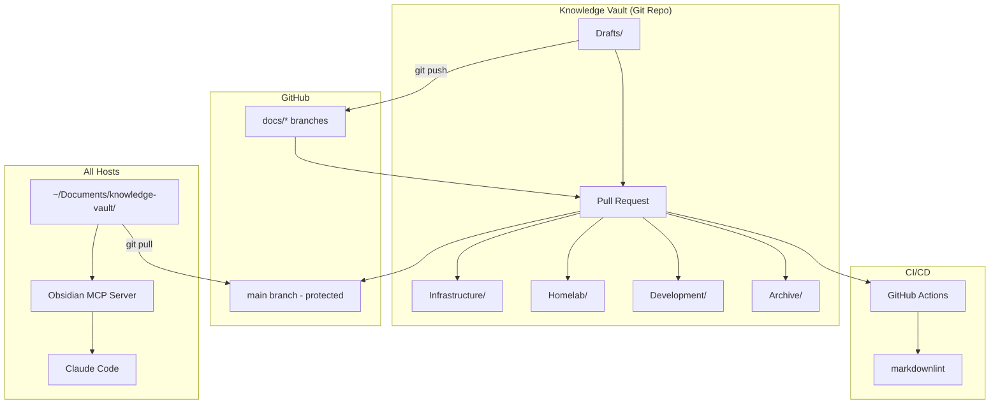

# Obsidian Documentation Workflow Design

**Date:** 2026-02-20
**Status:** Approved
**Type:** Architecture Design

## Overview

Design for vault-first documentation system using Obsidian + MCP, replacing scattered repo-based docs with a unified knowledge base accessible on all hosts via Claude Code.

## Problem Statement

Current state:
- Documentation scattered across multiple repo `docs/` folders
- Duplication of concepts across projects
- No unified way to query documentation on servers
- CLAUDE.md files are project-specific but not linked
- No collaboration model for LLM-generated documentation
- No version control for documentation evolution

Goals:
- Single source of truth for all documentation
- Prevent duplication across projects
- Enable human + AI collaboration via PR workflow
- Queryable on all hosts (desktop + servers) via MCP
- Proper version control and history
- Clean draft management

## Design Decisions

### 1. Vault Structure: Domain-Driven Organization

```
~/Documents/knowledge-vault/
├── Drafts/                          # WIP docs (PR required to move out)
│   ├── <topic-name>/               # Grouped by topic/discussion
│   └── orphaned/                   # Flagged by cleanup script
│
├── Infrastructure/                  # NixOS, system config, deployment
│   ├── Concepts/                   # Nix flakes, modules, specialisations
│   ├── Architecture/               # System design, host patterns
│   ├── Runbooks/                   # nixos-rebuild, SOPS, secrets
│   └── Projects/                   # Active infra work
│
├── Homelab/                         # Kubernetes, GitOps, cluster ops
│   ├── Concepts/                   # k3s, Flux, GitOps patterns
│   ├── Architecture/               # Cluster design, networking
│   ├── Runbooks/                   # Deploy, troubleshoot, upgrade
│   └── Projects/                   # Active homelab initiatives
│
├── Development/                     # Dev tools, workflows, agents
│   ├── Concepts/                   # Claude Code, MCP, skills, agents
│   ├── Workflows/                  # Git, testing, CI/CD, PR reviews
│   └── Projects/                   # Tool development
│
├── Meta/                            # Vault management
│   ├── templates/                  # Doc templates (concept, runbook, etc.)
│   ├── scripts/                    # Automation scripts
│   │   ├── sync-vault.sh          # Pull latest from remote
│   │   ├── cleanup-drafts.sh      # Flag abandoned drafts
│   │   └── migrate-repo-docs.sh   # One-time migration helper
│   └── README.md                   # Vault usage guide
│
└── Archive/                         # Deprecated/completed docs
    └── <year>/<topic>/
```

**Rationale:**
- Domain boundaries prevent duplication ("NixOS concepts" lives once in Infrastructure/Concepts/)
- Natural organization matching how work is conceptualized
- Scales as knowledge grows
- Cross-project concepts have clear home

### 2. Git Workflow: PR-Required with Protected Main

**Branch protection:**
- `main` is protected, read-only (GitHub branch protection)
- All changes via Pull Requests
- No direct commits to `main`

**Workflow:**



**PR requirements:**
- Must move file(s) out of `Drafts/` folder
- Frontmatter must be valid (checked by CI)
- Markdown must pass linting (markdownlint-cli2)
- At least 1 approval (can be self-approved for solo work)

**Branch naming convention:**
- `docs/<domain>/<topic>` (e.g., `docs/infrastructure/specialisations`)

**Rationale:**
- Enables human-LLM collaboration via GitHub discussions
- Multiple agents/hosts can work simultaneously without conflicts
- PR history provides context for document evolution
- CI catches formatting/validation issues before merge

### 3. Draft Lifecycle: Drafts Folder + Cleanup Automation

**Draft workflow:**

1. **Creation**: Docs start in `Drafts/<topic-name>/`
2. **Iteration**: Work happens locally, commits to branch
3. **Promotion**: PR moves files to final domain location
4. **Cleanup**: Original draft deleted in same PR

**Automated cleanup script** (`Meta/scripts/cleanup-drafts.sh`):

```bash
# Runs weekly via systemd timer (or manually)
# Flags drafts older than 30 days with no commits
# Moves to Drafts/orphaned/ for review
```

**Orphaned draft handling:**
- Drafts in `Drafts/orphaned/` reviewed monthly
- Either promote to final location or delete
- Prevents draft accumulation

**Draft retention policy:**
- Active drafts: unlimited time if commits within 30 days
- Orphaned drafts: 90 days in orphaned/ then auto-deleted
- Published docs: never auto-deleted, must be manually archived

**Rationale:**
- Prevents Drafts/ folder from becoming a junk drawer
- Clear lifecycle: draft → review → publish → archive
- Automation reduces manual cleanup burden
- Preserves context via git history even for abandoned drafts

### 4. Document Standards: Frontmatter + Templates + Validation

**Standard frontmatter:**

```yaml
---
title: "Document Title"
domain: infrastructure|homelab|development
type: concept|architecture|runbook|plan|decision
tags: [nixos, k3s, claude-code]
created: 2026-02-20
updated: 2026-02-20
status: draft|published|deprecated
related: ["[[Other Doc]]", "[[Another Doc]]"]
---
```

**Three-layer validation:**

1. **Obsidian Linter plugin** (GUI users)
   - Auto-formats on save
   - Enforces YAML frontmatter
   - Corrects markdown syntax

2. **markdownlint CI** (PR validation)
   - Runs on all PRs via GitHub Actions
   - Custom rules:
     - Frontmatter required (title, domain, type, created, updated, status)
     - Valid domain values (infrastructure|homelab|development)
     - Valid type values (concept|architecture|runbook|plan|decision)
     - No broken wikilinks
     - Mermaid diagrams valid syntax

3. **documentation-to-obsidian skill** (Agent enforcement)
   - Agents must use skill for doc writing
   - Skill generates proper frontmatter
   - Uses templates from `Meta/templates/`

**Mermaid diagram standards:**

Required in:
- **Architecture docs**: Component relationship diagram
- **Runbooks**: Workflow/process flowchart
- **Complex concepts**: Visual representation

**Templates** (`Meta/templates/`):
- `concept.md` - For concepts (e.g., "How Nix flakes work")
- `architecture.md` - For system design docs
- `runbook.md` - For operational guides
- `plan.md` - For implementation plans
- `decision.md` - For ADRs

**Rationale:**
- Consistent structure makes docs queryable by LLMs
- Frontmatter dates enable "show me recent docs" queries
- Templates reduce friction for creating new docs
- CI validation prevents malformed docs from merging
- Mermaid diagrams make complex topics visual

### 5. History & Versioning: Git + Frontmatter Hybrid

**Approach:**
- Git handles detailed history automatically
- Frontmatter `created` and `updated` dates make docs queryable
- No manual versioning unless formal spec/RFC needs versions
- Archives for deprecated docs

**History queries (via MCP):**
- "Show me all docs updated in the last week"
- "What changed in the architecture docs recently"
- "Find deprecated runbooks"

**Git benefits:**
- Full blame/log history via `git log <file>`
- Diff between versions via `git diff <commit1> <commit2> -- <file>`
- Restore previous versions if needed

**Rationale:**
- Git provides detailed history without manual overhead
- Frontmatter dates enable semantic queries by LLMs
- Simple and maintains context without extra work
- No version number bikeshedding

### 6. Migration Strategy: Orchestrated Subagent Migration

**Phase 1: Preparation**
```bash
# Clone all recent repos to this machine via gh CLI
gh repo clone sammasak/claude-code-skills ~/claude-code-skills
gh repo clone sammasak/workstation-api ~/workstation-api
gh repo clone sammasak/project-jarvis ~/project-jarvis
gh repo clone sammasak/jarvis-ui ~/jarvis-ui
gh repo clone sammasak/nixos-config ~/nixos-config
gh repo clone sammasak/homelab-gitops ~/homelab-gitops
gh repo clone sammasak/playground ~/playground
```

**Phase 2: Parallel subagent migration**

For each repo, spawn a subagent with context:

```
Subagent task:
- Repo: ~/homelab-gitops
- Read all docs in repo (docs/, README.md, etc.)
- Decide what to migrate (skip CLAUDE.md, it stays)
- Decide which domain fits best (Infrastructure/Homelab/Development)
- Migrate docs to vault domain structure:
  - Categorize into Concepts/Architecture/Runbooks/Projects
- Add proper frontmatter to migrated docs
- Delete docs/ folder from repo
- Add README note: "Documentation moved to knowledge vault"
- Commit changes to repo
- Push to remote
- Report: what was migrated, what was skipped, what was unclear
```

**Initial domain guidance (subagents can override):**
- `claude-code-skills` → Development/
- `workstation-api` → Development/
- `project-jarvis` → Homelab/
- `nixos-config` → Infrastructure/
- `homelab-gitops` → Homelab/
- `playground` → Development/ (or Archive/)
- `jarvis-ui` → Development/

**Orchestration strategy:**
- Spawn one subagent per repo
- Each gets domain guidance but makes final decision
- Agents work independently
- Collect reports and handle conflicts/deduplication after all migrations complete

**Phase 3: Deduplication**
- After all subagents complete, scan vault for duplicates
- Use semantic similarity (LLM-based) to find duplicate concepts
- Merge duplicates manually or via dedicated dedup agent

**Phase 4: Verification**
- All repos have docs/ removed
- All docs have proper frontmatter
- No broken wikilinks
- Vault git history shows migration commits

**Rationale:**
- Subagents understand content and make informed categorization decisions
- Parallel execution faster than sequential
- Human orchestration handles conflicts/edge cases
- One-time migration effort with clear completion criteria

### 7. Vault Synchronization: Sync Skill + MCP Access

**All hosts get vault + MCP** (already configured in NixOS):
- Obsidian MCP server configured in `claude-code/mcp.nix` ✅
- Vault structure defined in `obsidian/default.nix` ✅
- Already deployed to all hosts

**Sync strategy:**



**New skill: `vault-sync`**
```bash
# Ensures vault is up-to-date before Claude works
cd ~/Documents/knowledge-vault
git fetch origin
git pull --rebase origin main
```

**Integration points:**
- Skill auto-runs when using `documentation-to-obsidian` skill
- Can be manually invoked: "sync my vault"
- Warns if local changes conflict with remote

**MCP benefits:**
- All hosts can query vault via Claude Code
- No repo cloning needed on servers
- Agents can read/write docs via MCP tools

**Rationale:**
- Prevents stale vault causing incorrect documentation
- MCP makes docs accessible without cloning all repos
- Sync skill reduces manual git pull commands
- Works on servers without GUI

## Architecture Overview



## Benefits

1. **No duplication**: Single source of truth per concept
2. **LLM + human collaboration**: PRs enable async discussion
3. **Queryable everywhere**: MCP on all hosts, no repo cloning
4. **Proper version control**: Git history + frontmatter dates
5. **Clean draft management**: Automated cleanup prevents cruft
6. **Validation enforced**: CI + skills prevent bad docs
7. **Visual documentation**: Mermaid diagrams make concepts clear
8. **Autonomous migration**: Subagents handle repo migration
9. **Disaster recovery**: Everything in git, vault synced separately
10. **Atomic updates**: NixOS config ensures MCP + structure on all hosts

## Trade-offs

### Chosen:
- **Vault-first** (vs repo-first): Accepts that CLAUDE.md stays in repos, all other docs migrate
- **Domain-driven** (vs project-centric): Requires thinking about domain boundaries but prevents duplication
- **PR-required** (vs direct commits): Adds friction but enables collaboration and validation
- **Drafts folder** (vs git branches): Simpler UX for Obsidian, avoids files appearing/disappearing
- **Hybrid versioning** (vs manual versions): Git history + frontmatter dates, no version numbers

### Rejected:
- **Git branches for drafts**: Obsidian doesn't handle disappearing files well
- **Project-centric structure**: Would lead to duplication between Projects/
- **No validation**: Would allow malformed docs to merge
- **Manual sync**: Too easy to forget, leads to stale vault

## Success Criteria

- [ ] All recent repos migrated to vault
- [ ] No docs/ folders remain in repos (except CLAUDE.md)
- [ ] All migrated docs have proper frontmatter
- [ ] No duplicate concepts across vault
- [ ] CI validates all PRs
- [ ] Sync skill works on all hosts
- [ ] MCP can query vault from any host
- [ ] Drafts cleanup script functional
- [ ] Templates available in Meta/templates/
- [ ] Main branch protected on GitHub

## Next Steps

After design approval:
1. Create implementation plan (invoke writing-plans skill)
2. Execute migration (orchestrate subagents)
3. Set up CI/CD (GitHub Actions + markdownlint)
4. Deploy vault-sync skill
5. Configure branch protection
6. Test workflow end-to-end

## Related Documents

- `/home/lukas/nixos-config/SETUP_OBSIDIAN.md` - Existing Obsidian setup guide
- `/home/lukas/nixos-config/modules/programs/gui/obsidian/README.md` - Current Obsidian module architecture
- `/home/lukas/nixos-config/modules/programs/cli/claude-code/mcp.nix` - MCP server configuration
